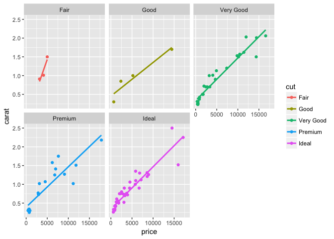

Introduction: I wanted to find out whether diamonds increase in price
with increasing carats. Methods: I used the dsmall table, which is a
subset of the larger diamonds dataset. I made a plot of carat vs price.
I also colored and facet-wrapped by the cut value. Results: The plots
all show an increase in price with increasing carats. Discussion:
Diamonds do increase in price with increasing carats.

    library(ggplot2)
    set.seed(1410)
    dsmall <- diamonds[sample(nrow(diamonds), 100), ]

    savePlot <- function(task6plot) {
            pdf("task6plot.png")
            print(task6plot)
            dev.off()
    }

    task6plot <- ggplot(dsmall, aes(price, carat, color = cut, )) +
      geom_point() +
      geom_smooth(method = "lm", se = FALSE) +
      facet_wrap(~cut)
    print(task6plot)

    savePlot(task6plot)

    ## quartz_off_screen 
    ##                 2
