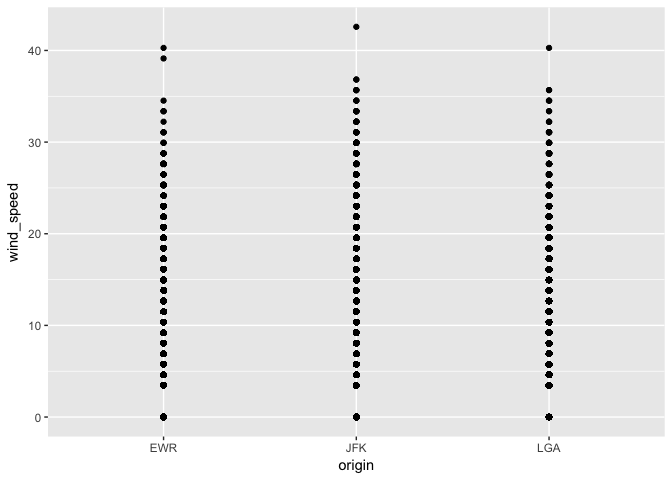
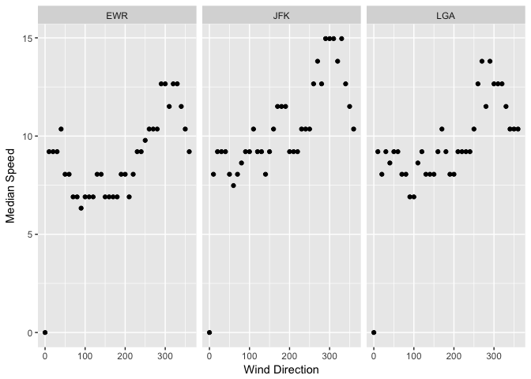
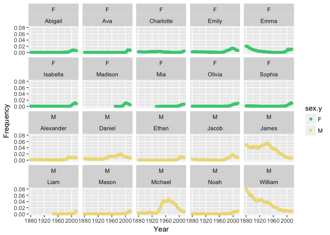
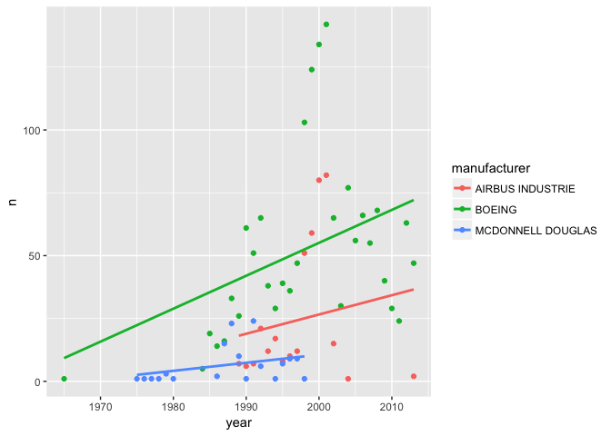

This code sets some options for how the chunks will be displayed and
saved. Echo = TRUE means the R code will be saved when the document is
knitted. fig.path tells it where to save the figures to.

This code tells R to load the nycflights13 dataset, the babynames
dataset, and the tidyverse packages.

    library(nycflights13)
    library(tidyverse)

    ## Loading tidyverse: ggplot2
    ## Loading tidyverse: tibble
    ## Loading tidyverse: tidyr
    ## Loading tidyverse: readr
    ## Loading tidyverse: purrr
    ## Loading tidyverse: dplyr

    ## Conflicts with tidy packages ----------------------------------------------

    ## filter(): dplyr, stats
    ## lag():    dplyr, stats

    library(babynames)

This code makes a table called "wind" by selecting only the origin, wind
direction, and wind speed columns from the weather dataset in
nycflights13.

    wind <- nycflights13::weather %>%
      select(origin, wind_dir, wind_speed)
    print(wind)

    ## # A tibble: 26,130 × 3
    ##    origin wind_dir wind_speed
    ##     <chr>    <dbl>      <dbl>
    ## 1     EWR      230   10.35702
    ## 2     EWR      230   13.80936
    ## 3     EWR      230   12.65858
    ## 4     EWR      230   13.80936
    ## 5     EWR      240   14.96014
    ## 6     EWR      270   10.35702
    ## 7     EWR      250    8.05546
    ## 8     EWR      240   11.50780
    ## 9     EWR      250   12.65858
    ## 10    EWR      260   12.65858
    ## # ... with 26,120 more rows

This code uses ggplot2 to make a plot of wind speed vs the airport of
origin to determine if there are any clear outliers that should be
removed. There is one point over 1000 mph which should be removed before
further operations.

    ggplot(wind) + geom_point(aes(x = origin, y = wind_speed)) 

    ## Warning: Removed 3 rows containing missing values (geom_point).

This code filters the wind speed data to remove the point over 1000 mph.

    wind1 <- wind %>%
      filter(wind_speed<1000)
    head(wind1)

    ## # A tibble: 6 × 3
    ##   origin wind_dir wind_speed
    ##    <chr>    <dbl>      <dbl>
    ## 1    EWR      230   10.35702
    ## 2    EWR      230   13.80936
    ## 3    EWR      230   12.65858
    ## 4    EWR      230   13.80936
    ## 5    EWR      240   14.96014
    ## 6    EWR      270   10.35702

This code makes a plot of wind speed vs origin with the filtered data to
see if there are any more outliers. There are not.

    ggplot(wind1) + geom_point(aes(x = origin, y = wind_speed))

This code makes a new table of the median wind speed for each direction
at each airport. First, we group the data first by airport of origin and
and then by wind direction. Then we can calculate the median wind speed,
and it will be displayed as one median speed per wind direction per
airport.

    median_wind <- wind1 %>%
      group_by(origin, wind_dir) %>%
      summarise(med_speed = median(wind_speed, na.rm = TRUE))
    median_wind

    ## Source: local data frame [114 x 3]
    ## Groups: origin [?]
    ## 
    ##    origin wind_dir med_speed
    ##     <chr>    <dbl>     <dbl>
    ## 1     EWR        0   0.00000
    ## 2     EWR       10   9.20624
    ## 3     EWR       20   9.20624
    ## 4     EWR       30   9.20624
    ## 5     EWR       40  10.35702
    ## 6     EWR       50   8.05546
    ## 7     EWR       60   8.05546
    ## 8     EWR       70   6.90468
    ## 9     EWR       80   6.90468
    ## 10    EWR       90   6.32929
    ## # ... with 104 more rows

This code plots the median wind speed vs the wind direction, with one
plot for each airport of origin.

    med_wind_plot <- ggplot(median_wind) + geom_point(aes(x = wind_dir, y = med_speed)) + facet_wrap(~origin) + xlab("Wind Direction") + ylab("Median Speed")
    print(med_wind_plot)

    ## Warning: Removed 3 rows containing missing values (geom_point).

This code makes a table by joining the airlines dataset to the flights
dataset using their common column "carrier". The data are then filtered
to only those with the origin airport of JFK. They are arranged by
descending distance, and then selected so only the airline name and
distance columns are retained.

    JFK_dist <- left_join(nycflights13::airlines, nycflights13::flights, by = "carrier") %>%
      filter(origin == "JFK") %>%
      arrange(desc(distance)) %>%
      select(name, distance)

This code makes a new table by joining the airlines dataset to the
flights dataset. The data are then filtered to only those points with
EWR as the airport of origin. They are grouped by airline name and
month. The summarize function makes a new column named "n" that lists
the number of flights that leave EWR each month. The spread function
then makes the table into a wide format table.

    EWR_flights <- left_join(nycflights13::airlines, nycflights13::flights, by = "carrier") %>%
      filter(origin == "EWR") %>%
      group_by(name, month) %>%
      summarize(n=n()) %>%
      spread(key = month, n)

This code makes a table using the babynames dataset; it is filtered to
only include names from the year 2014 and grouped by sex, so that when
the top\_n function is applied it will save only the top 10 names for
each sex.

    name_freq_14 <- babynames %>%
      filter(year == "2014") %>%
      group_by(sex) %>%
      top_n(10, n)

    name_freq_all <- inner_join(babynames, name_freq_14, by = "name", na.rm = TRUE) %>%
      filter(sex.x == sex.y) %>%
      select(name, year.x, prop.x, sex.y)

    name_plot <- ggplot(name_freq_all, aes(x = year.x, y = prop.x, color = sex.y)) + 
      geom_point() +
      scale_color_manual(values = c("seagreen3", "lightgoldenrod2")) + 
      facet_wrap(~ sex.y + name) + 
      xlab("Year") + 
      ylab("Frequency")
    print(name_plot)

    girl_names <- babynames %>%
      filter(sex == "F", year == 1896|year == 1942|year == 2016) %>%
      group_by(year) %>%
      mutate(ranking = dense_rank(desc(n))) %>%
      filter(ranking > 25 & ranking < 30)
    print(girl_names)

    ## Source: local data frame [9 x 6]
    ## Groups: year [2]
    ## 
    ##    year   sex    name     n        prop ranking
    ##   <dbl> <chr>   <chr> <int>       <dbl>   <int>
    ## 1  1896     F  Martha  2022 0.008023969      26
    ## 2  1896     F  Esther  1964 0.007793805      27
    ## 3  1896     F Frances  1964 0.007793805      27
    ## 4  1896     F   Edith  1932 0.007666819      28
    ## 5  1896     F  Myrtle  1928 0.007650945      29
    ## 6  1942     F   Helen 10014 0.007202575      26
    ## 7  1942     F Marilyn  9904 0.007123458      27
    ## 8  1942     F   Diane  9550 0.006868843      28
    ## 9  1942     F  Martha  9513 0.006842231      29

I want to find the number of planes manufactured by certain
manufacturers for each year. First, I group the data by the name of the
manufacturer and then by the year each plane was made. I then use the
summarise function to make a column counting the number of planes per
year per manufacturer. Then I arrange them in ascending order by year so
it is easy to read.

    planes_make <- nycflights13::planes %>%
      group_by(manufacturer, year) %>%
      summarise(n = n()) %>%
      select(manufacturer, year, n) %>%
      arrange(year)
    print(planes_make)

    ## Source: local data frame [164 x 3]
    ## Groups: manufacturer [35]
    ## 
    ##    manufacturer  year     n
    ##           <chr> <int> <int>
    ## 1       DOUGLAS  1956     1
    ## 2        CESSNA  1959     1
    ## 3   DEHAVILLAND  1959     1
    ## 4        CESSNA  1963     2
    ## 5        BOEING  1965     1
    ## 6         BEECH  1967     1
    ## 7         PIPER  1968     1
    ## 8         BEECH  1972     1
    ## 9        CESSNA  1973     1
    ## 10 CANADAIR LTD  1974     1
    ## # ... with 154 more rows

This code filters the table made above to include only planes
manufactured by Boeing, Airbus, and McDonnell Douglas.

    some_planes <- planes_make %>%
      filter(manufacturer == "BOEING"|manufacturer == "AIRBUS INDUSTRIE"|manufacturer == "MCDONNELL DOUGLAS")
    some_planes

    ## Source: local data frame [68 x 3]
    ## Groups: manufacturer [3]
    ## 
    ##         manufacturer  year     n
    ##                <chr> <int> <int>
    ## 1             BOEING  1965     1
    ## 2  MCDONNELL DOUGLAS  1975     1
    ## 3  MCDONNELL DOUGLAS  1976     1
    ## 4  MCDONNELL DOUGLAS  1977     1
    ## 5  MCDONNELL DOUGLAS  1978     1
    ## 6  MCDONNELL DOUGLAS  1979     3
    ## 7  MCDONNELL DOUGLAS  1980     1
    ## 8             BOEING  1984     5
    ## 9             BOEING  1985    19
    ## 10            BOEING  1986    14
    ## # ... with 58 more rows

This code makes a plot of the table in the previous step, showing the
number of planes manufactured per year, color coded by manufacturer.

    planes_plot <- ggplot(some_planes, aes(x = year, y = n, color = manufacturer)) +
      geom_point() +
      geom_smooth(method = "lm", se = FALSE)
    print(planes_plot)

    ## Warning: Removed 3 rows containing non-finite values (stat_smooth).

    ## Warning: Removed 3 rows containing missing values (geom_point).

